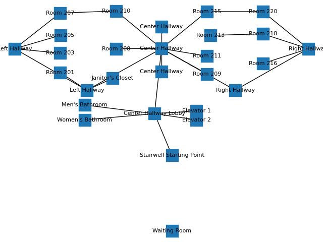
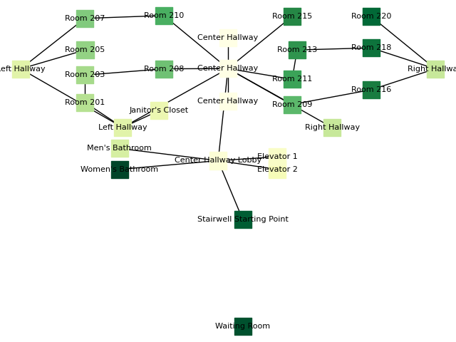
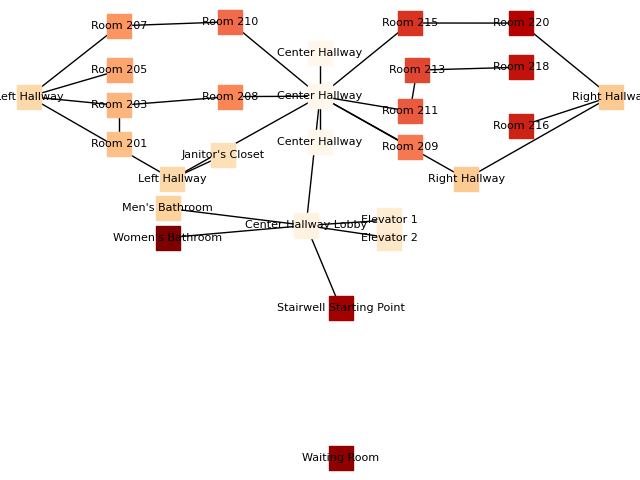
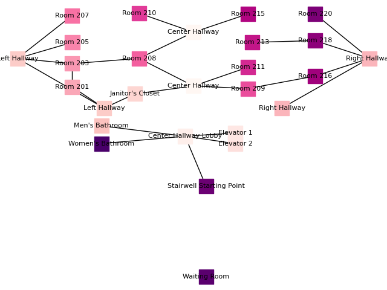

# Next room prediction for Sparky maps 

We evaluate next room prediction for faux human and actual human trajectories on simulated search and rescue scenario. 
The base map and three variants of perturbations are shown here. 






## Methods 
1. rule-based models based on graph connectivity
```
python3 rule_based_general_dp.py
```

2. neural sequence models like Recurrent Neural Networks and Transformer Models
```
python3 train_transformer_model.py
(generates best-model-parameters.pt)

python3 eval_transformer_model.py
(needs human data in resources/human_room_nav.csv)

```

* Generate human data - Tejus's Faux humans 
```
cd asist_agent
python3 examples/collect_data.py
```
* Human data folder - Huao's experiment on Sparky 0/1/2
```
Load data at the same level in sparky_data folder
with these folders:
$ls sparky_data
    Decision_points   
    Message_bus_data
    Events            
    FOV_events       
    TestbedMap.json
```